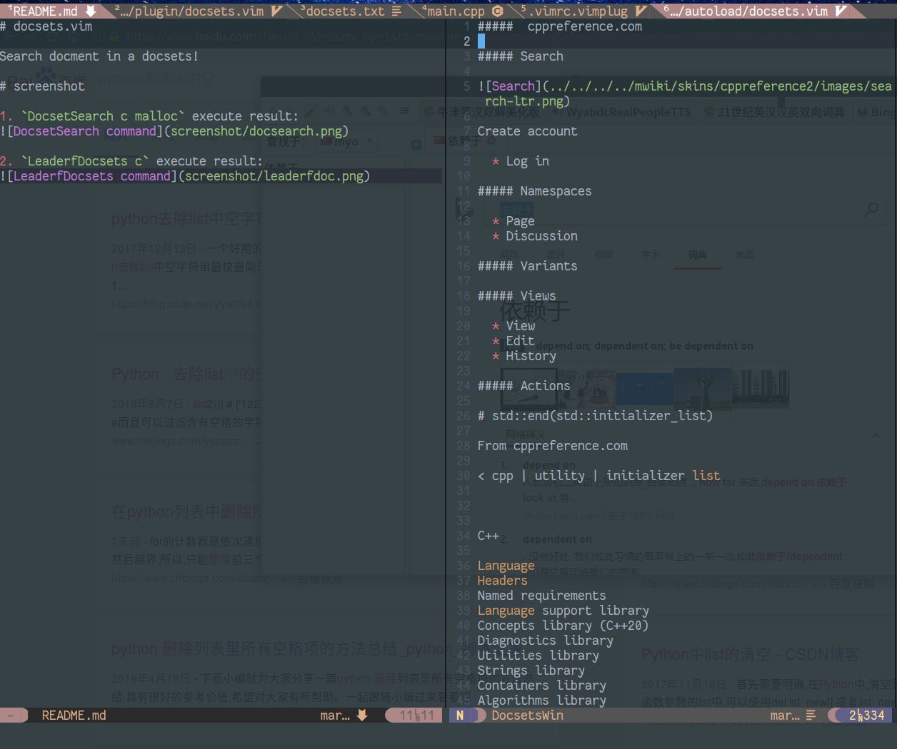
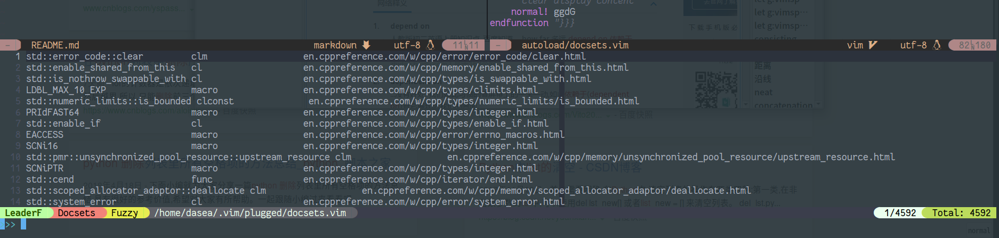

# docsets.vim

Search docment in a docsets!

## screenshot

1. `DocsetSearch c malloc` execute result:

2. `LeaderfDocsets c` execute result:

## todo

because the origin type of docment is html, but when display it in vim, i use markdown,``
so, i need convert, and the result has too many invalilable content; next, get fine result!
